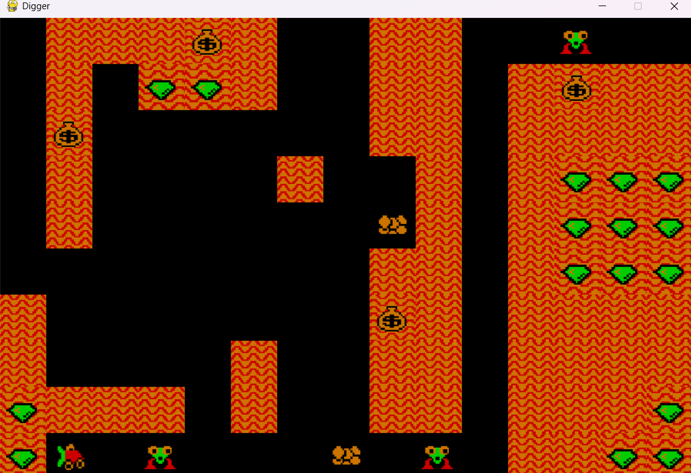

# 🕹️ Digger Game with Dynamic AI Pathfinding

A custom, from-scratch implementation of the classic arcade 2D grid game developed in Python. This project showcases intricate gameplay state loops, dynamic tile manipulation, gravity-based object physics, and an advanced, real-time adversarial AI agent.

---

## 🎮 Core Gameplay Mechanics

* **Digging & Exploration:** The player controls a character navigating through a grid filled with sand tiles. Moving into a sand tile successfully "digs" and destroys it, clearing a path.
* **Objective:** Collect all distributed gold items on the map to achieve victory.
* **Gravity & Environmental Hazards:** Gold elements are subject to environmental physics. If a player digs out the sand directly beneath a gold item, it falls downward due to gravity. 
* **Strategic Combat:** Falling gold can crush and eliminate pursuing monsters if they intersect during the fall. Defeated monsters undergo a specific respawn cooldown timer, giving the player a temporary window to collect gold safely.

---

## 🤖 Monster AI Mechanics & Pathfinding Pipeline

The enemy agents are designed to be slightly faster than the player, requiring tactical play. Their movement is driven by a sophisticated graph-search pipeline executed on every frame render loop:

1. **Distance Metric Evaluation:** The monster initially calculates the spatial offset relative to the player's real-time position using the **Manhattan Distance** metric.
2. **Pathfinding via Dijkstra's Algorithm:** To navigate the dynamic grid, the AI models the game map as a graph where cleared paths are traversable edges and remaining sand tiles act as solid obstacles.
3. **Dynamic Path Calculation:** On **every individual frame**, a localized **Dijkstra's Algorithm** is executed. It evaluates the absolute shortest obstacle-free path to intercept the player, ensuring the monster intelligently maneuvers around un-dug sand without clipping through the terrain.

$$D_{Manhattan} = |x_{monster} - x_{player}| + |y_{monster} - y_{player}|$$

---

## 🛠️ Tech Stack & Technical Concepts

* **Language:** Python
* **Libraries:** Pygame (for game loops, rendering, and collision handling)
* **Concepts Demonstrated:** * Graph Theory & Dynamic Pathfinding (Dijkstra's Algorithm)
    * Real-time State Machine optimization (Frame-by-frame path recalculation)
    * Grid-based Physics & Particle Gravity Simulation

---

## 📦 Installation & Execution

### Prerequisites
* Python 3.x
* Pygame library

### Quick Start
```bash
# Clone the repository
git clone [https://github.com/Tserentogtokh-B/digger_game.git](https://github.com/Tserentogtokh-B/digger_game.git)
cd digger_game

# Run the game
python main.py
```

